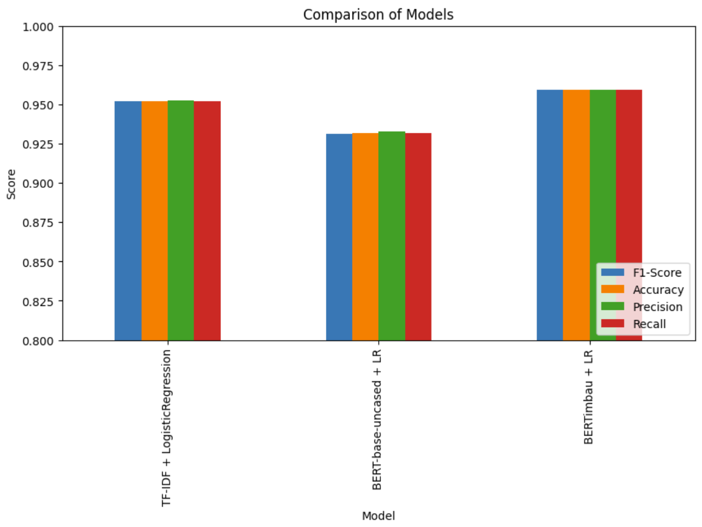

# NLP Final Project - Misinformation Detection

This repository contains a project focused on detecting misinformation in Brazilian Portuguese WhatsApp forwards. The project compares different NLP models applied to a binary text classification task: identifying whether a news piece is fake or not.

## Project Overview

The main goal of this project was to evaluate and compare different approaches for text classification, ranging from traditional machine learning methods to pre-trained language models.

### Step-by-Step Process

1. **Data Preprocessing**: 
   - Loaded and cleaned the dataset of WhatsApp messages.
   - Performed basic text preprocessing such as lowercasing and removal of special characters.

2. **Tokenization and Vectorization**:
   - For the traditional machine learning model, applied TF-IDF vectorization to convert text into numerical features.
   - For the transformer-based models, used pre-trained tokenizers compatible with BERT models.

3. **Model Training**:
   - **TF-IDF + Logistic Regression**: A baseline model using TF-IDF features with Logistic Regression.
   - **BERT-base-uncased + Logistic Regression**: Used embeddings from the English pre-trained BERT-base model, followed by Logistic Regression.
   - **BERTimbau + Logistic Regression**: Employed the BERTimbau model, a BERT variant pre-trained on Brazilian Portuguese, combined with Logistic Regression.

4. **Evaluation**:
   - Assessed model performance using standard metrics: F1-Score, Accuracy, Precision, and Recall.
   - Visualized performance metrics to compare model effectiveness.

---

## In-Domain Evaluation (Fake.Br Dataset)

The following table summarizes the in-domain performance of each model:

| Model                      | F1-Score | Accuracy | Precision | Recall  |
|--------------------------- |---------- |--------- |---------- |-------- |
| TF-IDF + LogisticRegression| 0.9518    | 0.9519   | 0.9526    | 0.9519  |
| BERT-base-uncased + LR     | 0.9314    | 0.9315   | 0.9330    | 0.9315  |
| BERTimbau + LR             | **0.9593**| **0.9593**| **0.9594**| **0.9593**|

The graphic below illustrates this performance:



### Key Insights:

- **BERTimbau + Logistic Regression** achieved the best performance across all metrics, confirming the advantage of using a model pre-trained on Brazilian Portuguese data.
- **TF-IDF + Logistic Regression** also performed well, showing that traditional models remain competitive with proper feature extraction.
- **BERT-base-uncased + Logistic Regression** underperformed due to the language mismatch (trained on English data).

---

## Cross-Domain Evaluation (Kaggle Fake News Dataset)

All models were tested on a different dataset sourced from Kaggle, which contains separate files for fake and true news in Brazilian Portuguese:
[Fake News Portuguese Dataset](https://www.kaggle.com/datasets/fabioselau/fakes-news-portuguese?select=true.csv)

### TF-IDF + Logistic Regression

```
              precision    recall  f1-score   support

        fake       0.88      1.00      0.94     20478
        true       0.00      0.00      0.00      2720

    accuracy                           0.88     23198
   macro avg       0.44      0.50      0.47     23198
weighted avg       0.78      0.88      0.83     23198

Confusion Matrix:
[[20471     7]
 [ 2720     0]]
```

### BERT-base-uncased + Logistic Regression

```
              precision    recall  f1-score   support

        fake       0.88      1.00      0.94     20478
        true       0.14      0.00      0.00      2720

    accuracy                           0.88     23198
   macro avg       0.51      0.50      0.47     23198
weighted avg       0.80      0.88      0.83     23198

Confusion Matrix:
[[20472     6]
 [ 2719     1]]
```

### BERTimbau + Logistic Regression

```
              precision    recall  f1-score   support

        fake       0.88      1.00      0.94     20478
        true       0.13      0.01      0.01      2720

    accuracy                           0.88     23198
   macro avg       0.51      0.50      0.47     23198
weighted avg       0.79      0.88      0.83     23198

Confusion Matrix:
[[20380    98]
 [ 2705    15]]
```

---

## Cross-Domain Analysis

All three models — TF-IDF, BERT-base-uncased, and BERTimbau — followed the same trend: they classified almost everything as *fake* in the Kaggle dataset. Although the overall accuracy reached 88%, this number is misleading due to the class imbalance (88% fake vs. 12% true).

The TF-IDF model failed completely to identify true news. BERT-base recognized only one sample, while BERTimbau slightly improved with 15 correct predictions out of 2,720.

### Key Takeaways

- Models trained on Fake.Br did not generalize to the Kaggle dataset.
- Vocabulary, writing style, and source differences severely impacted performance.
- All models showed near-zero recall for the minority class (`true`).
- Even robust models like BERTimbau failed under domain shift conditions.

### Potential Enhancements

- Train on diverse and heterogeneous datasets.
- Explore domain adaptation or fine-tuning on target data.

---

### Conclusion

This project demonstrated the strengths and limitations of various NLP approaches for misinformation detection in Brazilian Portuguese. In in-domain evaluations using the Fake.Br dataset, all models—especially BERTimbau—performed exceptionally well, achieving high accuracy and F1-scores. This confirmed that both traditional and transformer-based models can effectively handle classification tasks when the test data shares the same distribution as the training set.

However, **the cross-domain evaluations revealed the true challenge: generalization.** When tested on the Kaggle dataset, all models—TF-IDF, BERT-base, and even the domain-specific BERTimbau—failed to reliably detect true news, highlighting a significant weakness in real-world applicability. Despite achieving high accuracy due to class imbalance, **all models exhibited nearly zero recall for the minority class**, rendering them ineffective for balanced misinformation detection across different sources.

These findings underline a key lesson in machine learning: **high performance on a single dataset does not imply robustness.** Future efforts should focus on training with more diverse data, incorporating domain adaptation techniques, and validating models across multiple, heterogeneous sources to ensure real-world reliability.

In short, while these models excel in controlled settings, robust misinformation detection requires broader training data, better generalization strategies, and careful evaluation beyond accuracy metrics.

## Reference

Monteiro R.A., Santos R.L.S., Pardo T.A.S., de Almeida T.A., Ruiz E.E.S., Vale O.A. (2018) *Contributions to the Study of Fake News in Portuguese: New Corpus and Automatic Detection Results*. In: Villavicencio A. et al. (eds) Computational Processing of the Portuguese Language. PROPOR 2018. Lecture Notes in Computer Science, vol 11122. Springer, Cham.